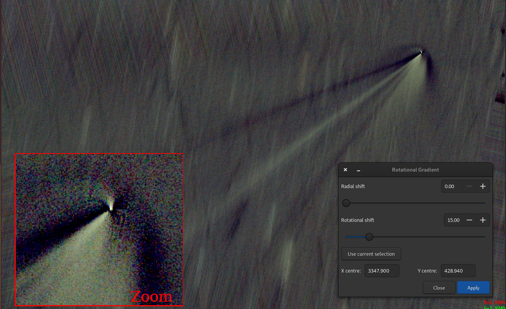

# Summary

Siril is a powerful open source software package designed for the pre- and post-processing of astronomical images. It is well suited for astrophotography enthusiasts and professional astronomers alike. Siril provides advanced tools for tasks such as image stacking, calibration, registration, and enhancement, enabling users to produce high quality images of celestial objects.

# Statement of Need

Astronomical imaging requires specialized software capable of handling the unique challenges presented by the data. Siril addresses these challenges by providing a suite of tools designed to process images from various types of astronomical instruments. Its robust feature set includes support for multiple image formats and precise photometric calibration techniques.

Siril stands out for its user-friendly interface and integration with other astronomical software packages. It offers a comprehensive solution for both amateur and professional astronomers to enhance their imaging workflows. The software has been utilized in numerous scientific publications and astrophotography projects, demonstrating its versatility and effectiveness.

There are many solutions available for astronomical imaging, but few are open source. For example, IRIS was a popular tool but has not been developed since 2005. Another well-known software, IRAF, consists of 40-year-old legacy code, and institutional support for IRAF and its use is rapidly declining. It is recommended to search for alternative solutions, such as those in the Astropy community, and to avoid starting new projects using IRAF [@endiras]. Siril fills this gap by providing a modern, open source alternative that continues to evolve and support the needs of the astronomical community.

# Features and Functionality

Siril provides a range of features to support astronomical image processing:

- **Image calibration**: Correction of biases, darks, and flats to calibrate astronomical images data.
- **Image registration and stacking**: Alignment of images taken at different times and their subsequent stacking to increase signal-to-noise ratio. This version also incorporates the Hubble Space Telescope drizzle algorithm [@fruchter2002drizzle] for applying WCS (World Coordinate System) and registration data transforms, providing improved detail reconstruction when processing sets of under-sampled images.
- **Advanced image enhancement**: Application of various filters and algorithms to improve image details and reduce noise. For example, the Larson-Sekanina filter is particularly useful for highlighting non-circular structures in images of comets by enhancing radial features and making structures like jets and dust trails more visible [@larson1984coma]. An example of such a filter applied to a comet image is given in \autoref{fig:rgradient}.

  
  
- **Astrometry**: Precise measurement and analysis of the positions and movements of celestial objects within the images. Siril includes functionalities for astrometric calibration, allowing users to find an astrometric solution and match observed star and solar system object positions with reference catalogs. It uses the WCS (World Coordinate System) features from FITS file keywords [@wcsI; @wcsII; @wcsIV].
- **Spectro photometric calibration**: Accurate calibration of image photometry using the latest version of the Gaia catalog [@refgaia] for recovering the true colors of astronomical objects in the images.
- **Photometry**: Capability to perform photometric analysis, including the creation of light curves for variable stars and the observation of exoplanet transits.
- **Scriptability**: Ability to automate repetitive tasks through scripting, increasing efficiency.

These are just a selection of the many features Siril offers. The number of functionalities is significantly larger and continuously growing as the software evolves.

# FreeAstro Ecosystem

The FreeAstro ecosystem encompasses various projects and repositories that support and extend the functionality of Siril. FreeAstro, [hosted on GitLab](https://gitlab.com/free-astro), serves as the umbrella organization for all projects related to Siril, fostering a collaborative environment for development, documentation, and community engagement.

- [siril-web](https://gitlab.com/free-astro/siril-web): The [official website](https://siril.org) for Siril, built using the open source static site generator Hugo and hosted by [pixls.us](https://pixls.us), which also hosts forums for open source image processing software. This site provides users with access to the latest news, updates, and resources related to Siril.
- [siril-doc](https://gitlab.com/free-astro/siril-doc): The documentation repository, hosted by ReadTheDocs. This repository contains comprehensive user manuals, guides, and reference materials to assist users in effectively utilizing Siril's features. There are two branches available: one for the [stable version](https://siril.readthedocs.io/en/stable) and one for the [development version](https://siril.readthedocs.io/en/latest).
- [siril-localized-doc](https://gitlab.com/free-astro/siril-localized-doc): Dedicated to the translation of Siril's documentation. This repository leverages Weblate, a translation platform, to support multiple languages and ensure that documentation is accessible to a global audience.
- [siril-spcc-database](https://gitlab.com/free-astro/siril-spcc-database): This repository stores data related to the Spectro Photometric Color Calibration (SPCC) tool. It includes JSON files detailing OSC/monochrome sensors and filters available on the market. The primary goal of this database is to collect extensive data and promote collaboration within the astronomy community.
- [siril-scripts](https://gitlab.com/free-astro/siril-scripts): A repository where users can share and contribute scripts that extend the functionality of Siril. These user-contributed scripts are integrated into Siril, providing additional tools and capabilities for the community.

# Acknowledgements

We acknowledge contributions from the Siril development community. Special thanks to our testers and users who provided invaluable feedback. We also extend our gratitude to François Meyer, who initiated the project over 20 years ago. Additionally, we thank the team at pixls.us for generously hosting our website and forums, supporting the open source image processing community.

# References

